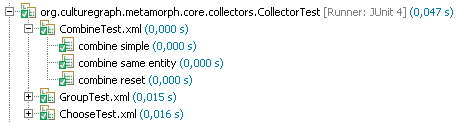

Testing Metamorph definition files follows a simple pattern. Given the
respective definition and an input, a specific output is expected. This can
easily be expressed in XML:

```xml
<metamorph-test version="1.0"
	xmlns="http://www.culturegraph.org/metamorph-test" 
	xmlns:mm="http://www.culturegraph.org/metamorph"
	xmlns:cgxml="http://www.culturegraph.org/cgxml">
   <test-case name="My Testcase1">
      <input type="text/x-cg+xml">
	<!-- Your test input goes here -->           
      </input>
      <transformation type="text/x-metamorph+xml">
          <!-- the metamorph definition you want to test goes here  -->   
      </transformation>
      <result type="text/x-cg+xml">
          <!-- the expected result goes here  -->  
      </result>
   </test-case>
</metamorph-test>
```

As of Metafacture 3.0.0 arbitrary data formats can be used to define the input and the expected result. The only requirement is that a reader for the specified mime-type is registered in [src/main/resources/metastream-readers.properties](https://github.com/culturegraph/metafacture-core/blob/master/src/main/resources/metastream-readers.properties). 

In the example above the Metamorph transformation was part of the test case. In real world scenarios it is much more likely that you want to test transformations in an existing file. This can be achieved by specifying a `src` attribute on the `<transformation>` element:

```xml
<metamorph-test version="1.0"
	xmlns="http://www.culturegraph.org/metamorph-test">
   <test-case name="My Testcase1">
      <input type="text/x-formeta">
	record-id {
           literal1: input-value
        }
      </input>
      <transformation type="text/x-metamorph+xml" src="path/to/metamorph/resource.xml" />
      <result type="text/x-formeta">
	record-id {
           literal1: result-value
        }
      </result>
   </test-case>
</metamorph-test>
```

By default the test framework requires that the order of records, literal and entity keys and values is as specified in the result. You can use the `strict-*-order` attributes to relax this requirement. There is one attribute for each level of ordering:

* `strict-record-order`: The order of records emitted by the transformation must match the result data (based on their id)
* `strict-key-order`: The order of keys must be same for the transformation output and the result data.
* `strict-value-order`: Within equally named keys the order of values must be same

# Integrate with JUnit #

How to integrate such a test definition written in XML into JUnit? JUnit feeds
on Java classes. Thus we need to provide such a class as a binding point:

```java
import org.culturegraph.mf.test.MetamorphTestSuite;
import org.culturegraph.mf.test.MetamorphTestSuite.TestDefinitions;
import org.junit.runner.RunWith;

@RunWith(MetamorphTestSuite.class)
@TestDefinitions({"My Testcase1.xml", "My Testcase2.xml"})
public final class MyTest {/*bind to xml test*/}
```

The `RunWith` annotation instructs JUnit to let `org.culturegraph.mf.test.MetamorphTestSuite` handle the testing.
Use the `TestDefinitions` annotation to tell `MetamorphTestSuite` were to look
for tests. If no such annotation is found, `MetamorphTestSuite` looks for an XML
files with the same name as the binding class. The XML files are expected to be
located in the same folder as the binding class. The rationale is that both
belong together and separating them would be confusing. Collocating the xml
files with the class files is causing trouble with some build environments
though. In the case of Maven there is an straight forward remedy. Add the following code to your POM: 

```xml
<testResources>
   <testResource>
     <directory>src/test/java</directory>
        <excludes><exclude>**/*.java</exclude></excludes>	
   </testResource>
   <testResource>
      <directory>src/test/resources</directory>
   </testResource>
</testResources> 
```

Here is an example test output in Eclipse:



The root
element is the binding class. Its children are the XML files, with the actual
tests as leafs.