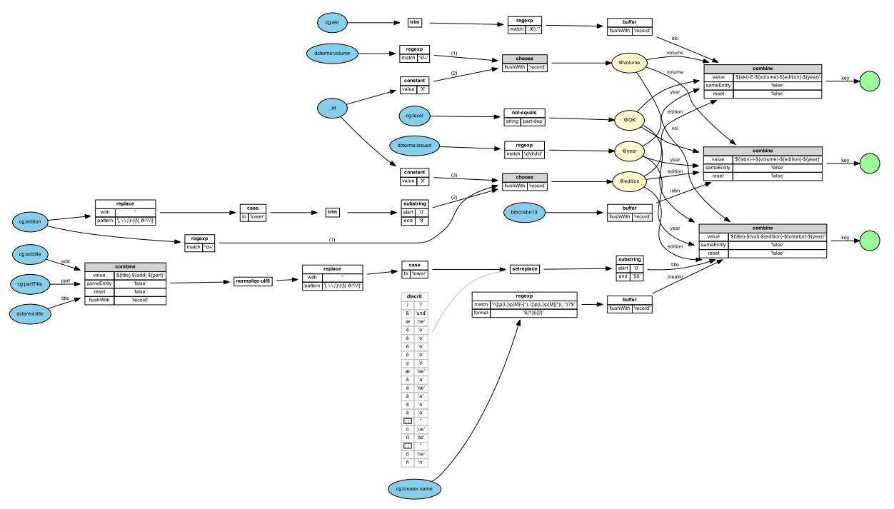

The processing model behind Metamorph is that of a data flow. Hence it is
straight forward to visualize Metamorph as a directed network, representing the
respective flow. Here is a modest example:




Blue ellipses represent data sources while green circles represent data output.
In our example we have a process with two combination stages and several
functions applied to intermediate data. Stages in which data is collected are
marked with a gray title bar showing the name of the operation. Functions are
represented by white boxes. Both contain all parameters as name-value-lists.
If lookup operations are included, the respective maps are
depicted as gray tables. Finally, recursion is
symbolized by yellow ellipses.

A visualization is generated by executing the class `org.culturegraph.mf.MorphVis` with a Metamorph definition as
argument. The output is a graph description in the dot language (see
http://www.graphviz.org/content/dot-language). To generate a
graphical representation any software compatible with the dot language can be
used. The most obvious choice is Graphviz (http://www.graphviz.org/). 

Here is an example for a Bash script using the Graphviz dot layouter:

```bash
#!/bin/bash
FORMAT=$1
FILE=$2
java org.culturegraph.mf.MorphVis $FILE | dot -T$FORMAT > $FILE.$FORMAT
```

Make sure to include the Graphviz binaries in your `$PATH` variable.
Related Bash scripts can also be found in the `bin/` folder.

